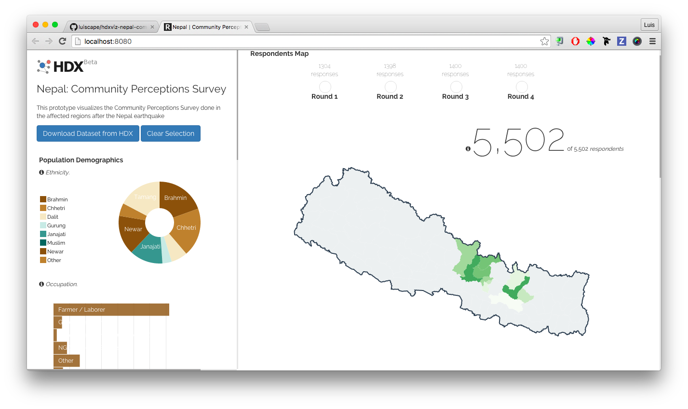

## Sample Visualization



This is a sample visualization used for training purposes. It uses the results from Flowminder models and creates an interactive visualization that allows for multi-dimensional filtering of many of the models variables.

## Data Sources
This visualization uses data sources available on the [Humanitarian Data Exchange](https://data.hdx.rwlabs.org/group/nepal-earthquake) repository. The breakdown of sources are:

### Tabular data
* Flowminder results (August): https://data.hdx.rwlabs.org/dataset/population-movements-after-the-nepal-earthquake-v5-up-to-19th-aug-2015

### Boundaries
* Admin 0: https://data.hdx.rwlabs.org/dataset/nepal-admin-level-0-administrative-boundaries-cod
* Admin 4: https://data.hdx.rwlabs.org/dataset/nepal-admin-level-4-administrative-boundaries-cod

### Variables
| Question                                                                                                          | Code | Equivalence |
|-------------------------------------------------------------------------------------------------------------------|------|-------------|
| 1. Are,your main problems being addressed? (Answer on a scale of 1-5),A0OD,A0JS,1a. What is your biggest,problem? | A0OD | A0JS        |
| 1a.,What is your biggest problem?                                                                                 | A1OD | A1JS        |
| 2. Are,you satisfied with what the government is doing for you after the earthquake?,(Answer on a scale of 1-5)   | B0OD | B0JS        |
| 3. Do,you have the information you need to get relief and support? (Answer on a,scale of 1-5)                     | C0OD | C0JS        |
| 3a.,What is the top thing that you need information about?                                                        | C1OD | C1JS        |
| 4. Are,you satisfied with what NGOs are doing for you after the earthquake? (Answer,on a scale of 1-5)            | D0OD | D0JS        |
| 5. Is,support provided in a fair way? (Answer on a scale of 1-5)                                                  | E0OD | E0JS        |

## Usage
After setup, run the `run.sh` script:

```shell
$ ./run.sh
```

This should start a loal HTTP server, usually on port 8080.
